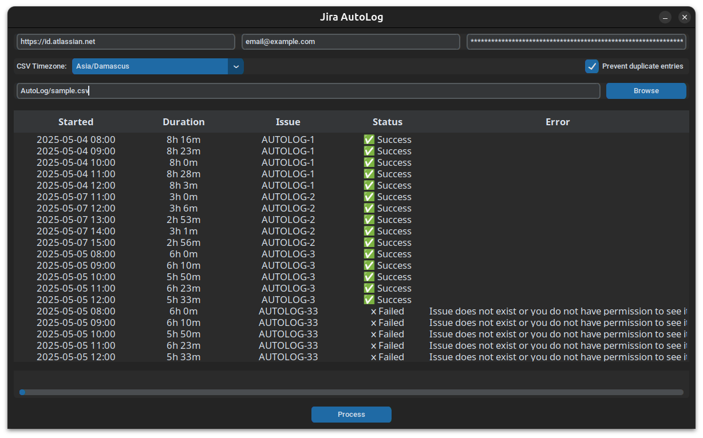

<div align="center">
  <a href="https://github.com/BishrGhalil/AutoLog">
    
  </a>
  <h1>AutoLog</h1>
  <p>
    automates the process of logging work entries into Jira.
  </p>
  <a href="https://github.com/BishrGhalil/AutoLog/releases/latest">
    
  </a>
  <a href="https://github.com/BishrGhalil/AutoLog/releases/latest">
    
  </a>
  <a href="https://github.com/BishrGhalil/AutoLog/tree/dev">
    
  </a>
  <a href="https://github.com/BishrGhalil/AutoLog/releases/">
    
  <a href="https://github.com/BishrGhalil/AutoLog/blob/dev/LICENSE">
    
  </a>
</div>


## About
**AutoLog** is a tool that automates the process of logging work entries into Jira from various data sources. Currently, the only supported data source is **CSV**, with support for additional sources planned for future releases.



## Prerequisites

- Python 3.10+
- Jira account with appropriate [API access](https://support.atlassian.com/atlassian-account/docs/manage-api-tokens-for-your-atlassian-account/#Create-an-API-token)
- CSV file formatted according to the expected schema ([see below](#csv-format))

---

## Installation & Setup

Clone the repository:

```bash
git clone https://github.com/BishrGhalil/AutoLog.git
cd AutoLog
```

Set up your Python environment:

```bash
python -m venv .venv
source .venv/bin/activate
python -m pip install -r requirements.txt
python main.py
```

---

## CSV Format

The input CSV should include the following columns (Kimai format), Order doesn't matter:

| Field                  | Description                                                        |
| ---------------------- | ------------------------------------------------------------------ |
| Date                   | Start date (e.g., 2025-05-07)                                      |
| From                   | Start time (e.g., 8:00)                                            |
| Duration               | Time spent in seconds                                              |
| Activity               | Contains Jira issue key (e.g., [PROJ-123] blah or [PROJ] 123 blah) |
| Description (optional) | Work log comment                                                   |

**Example**

| Date       | From  | Duration | Activity                      | Description                    |
| ---------- | ----- | -------- | ----------------------------- | ------------------------------ |
| 2025-05-04 | 08:00 | 28800    | [SWTF-7] Series Edit Page     | implemented series edit page   |
| 2025-05-07 | 11:00 | 10800    | [SWTF-8] Auto White Balancing |                                |
| 2025-05-05 | 08:00 | 21600    | [SWTF-9] Authentication       | refactored authentication code |

---

## Running the Tool

```bash
python main.py
```

---

## Development

```bash
python3 -m pip install uv
uv sync
pre-commit install
uv run main.py
```

Run linters:

```bash
ruff check .
```

Build executable:

```bash
pyinstaller --noconfirm --clean autolog.spec
```

[Signing the executable](https://gist.github.com/PaulCreusy/7fade8d5a8026f2228a97d31343b335e)

---

## Roadmap

- [X] Cooldown
- [X] Windows Executable
- [X] Code signing for Windows
- [ ] Async requests

---

## Contributing

Contributions are welcome. Please fork the repo and create a pull request.

---

## License

MIT License. See `LICENSE` file for details.
